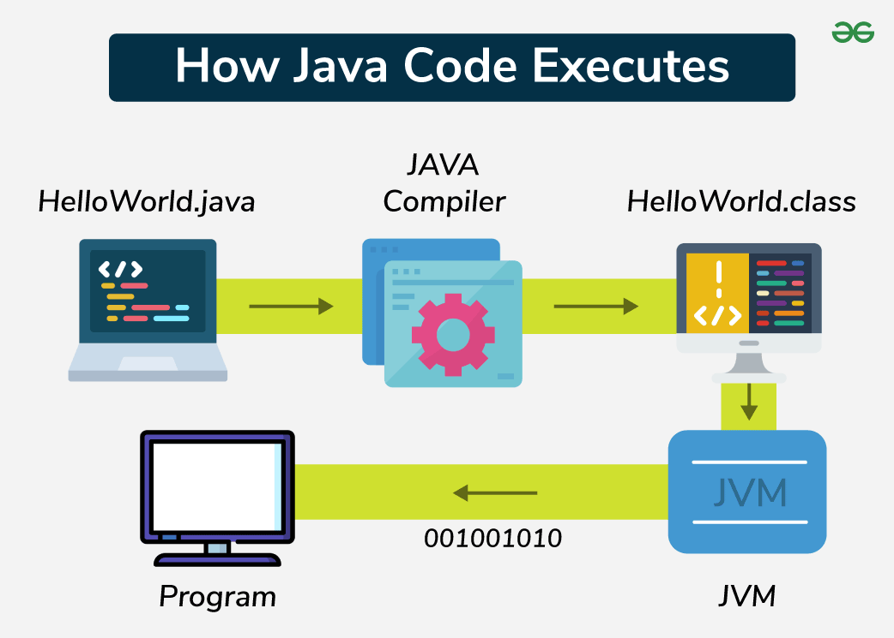
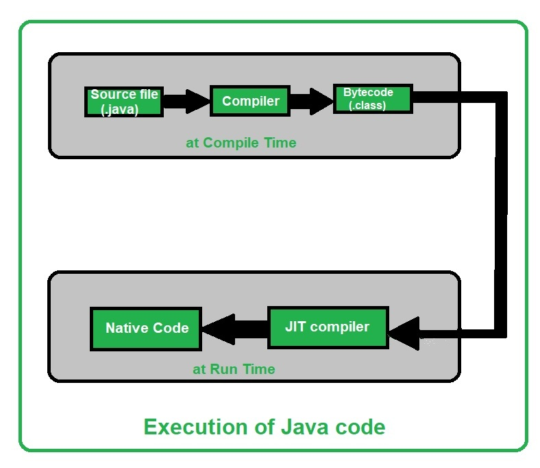
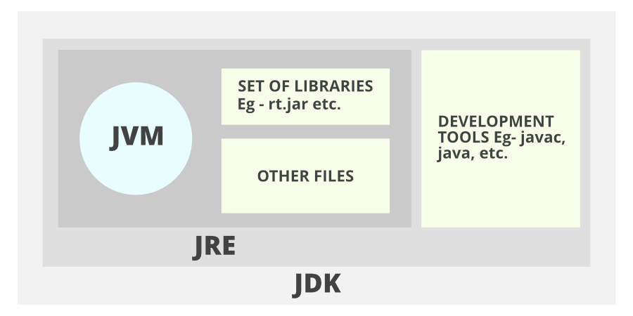
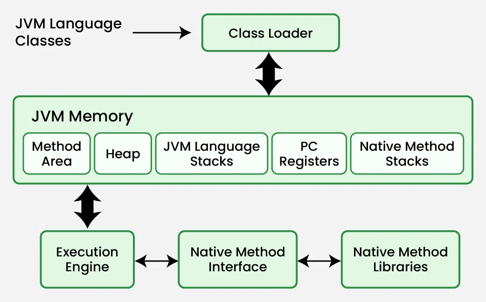

## JDK
- Java development typically requires the Java Development Kit (JDK), which includes the Java compiler and other essential tools. You can download the JDK from the official Oracle website and follow the installation instructions for your operating system.
---

Any hardware or software environment in which a program runs, is known as a platform. Since Java has a runtime environment (JRE) and API, it is called a platform.





##  JVM, JRE, and JDK
-  JVM, JRE, and JDK three are all platform-dependent because the configuration of each Operating System is different. But, Java is platform-independent.  Few things must be clear before setting up the environment which can better be perceived from the below image provided as follows:


- **JDK(Java Development Kit)**: JDK is intended for software developers and includes development tools such as the Java compiler, Javadoc, Jar, and a debugger.
- **JRE(Java Runtime Environment)**: JRE contains the parts of the Java libraries required to run Java programs and is intended for end-users. JRE can be viewed as a subset of JDK.
- **JVM** : JVM (Java Virtual Machine) is an abstract machine. It is a specification that provides a runtime environment in which java bytecode can be executed. JVMs are available for many hardware and software platforms.

## JAR File:-
- [Code Link](./Jar/)
- Create Jar File
    ```
    jar --create --file  .\JarTesting.jar .\JarTesting.class
    ```
- Execute JarFile
    ```
    java -cp  .\JarTesting.jar JarTesting
    ```

## JVM(Java Virtual Machine)



- We can access class details which is available in the method area is like class name,immediate parent class, Whether the “.class” file is related to Class or Interface or Enum, Modifier, Variables and Method information etc. [Code Link](./JVM/)

---
## [Garbage collection Project](./GarbageCollection/)
---
## Java Versions
[Blog on medium](https://medium.com/@nagarahalli.rashmi/java-ae9ae911f848#:~:text=As%20of%20September%202023%2C%20Java,SE%2017%2C%20Java%20SE%2021.)
Some Interesting features Which i knew
- JAVA 8
    - Lamda Expression 
    - Collection and stream API 
- JAVA 9
    - Helper Methods in collection ex **List.of(...)** 
    - Additions in Stram API like  takeWhile,dropWhile,iterate methods (JAVA 9)
        ```java
        Stream<String> stream = Stream.iterate("", s -> s + "s")
        .takeWhile(s -> s.length() < 10);
        ```
    - ifPresentOrElse methos in Optionals
        ```java
        user.ifPresentOrElse(this::displayAccount, this::displayLogin);
        ```
    - Intefaces got private methods
- JAVA 10
    - var keyword
- JAVA 11
    - some new methods in String and files
        ```java
        "Marco".isBlank();
        "Mar\nco".lines();
        "Marco  ".strip();

        Path path = Files.writeString(Files.createTempFile("helloworld", ".txt"), "Hi, my name is!");
        String s = Files.readString(path);
        ```
    - Run Source file
        ```
        java HelloWorld.java
        ```
- JAVA 12
    - Switch Expression (Finalize in JAVA 14)
        ```java
        int numLetters = switch (day) {
            case MONDAY, FRIDAY, SUNDAY -> 6;
            case TUESDAY                -> 7;
            default      -> {
                String s = day.toString();
                int result = s.length();
                yield result;
            }
        };
        ```
- JAVA 13
    - Multiline Strings (Finalize in JAVA 15)
        ```java
        String htmlWithJava13 = """
              <html>
                  <body>
                      <p>Hello, world</p>
                  </body>
              </html>
              """;
        ```
- JAVA 14
    - Records (There are now record classes, which help alleviate the pain of writing a lot of boilerplate with Java.) (Finslize in JAVA 15)
        ```java

        <!-- Before -->
        final class Point {
            public final int x;
            public final int y;

            public Point(int x, int y) {
                this.x = x;
                this.y = y;
            }
        }

        <!-- Update (Work is same as above)-->
        record Point(int x, int y) { }
        
        ```
    - Garbage collector CMS is Removed and Z is introduced
- JAVA 15
    - sealed classes (Finalize in JAVA 17)
    
        ```java
        public abstract sealed class Shape
        permits Circle, Rectangle, Square {...}
        ```
- JAVA 16
    - Pattern Matching **instanceof**
        ```java
        if (obj instanceof String) {
            String s = (String) obj;
            // e.g. s.substring(1)
        }

        //You can now do this:
        if (obj instanceof String s) {
            // Let pattern matching do the work!
            // ... s.substring(1)
        }
        ```
- JAVA 17
    - Pattern Matching For **switch** (Finalize ib JAVA 21)
        ```java
        public String test(Object obj) {

            return switch(obj) {

            case Integer i -> "An integer";

            case String s -> "A string";

            case Cat c -> "A Cat";

            default -> "I don't know what it is";

            };

        }
        ```

---
## [Basics of JAVA](./Basics/)
---