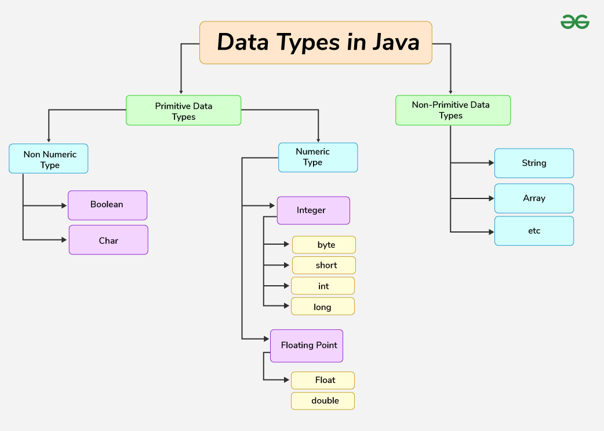
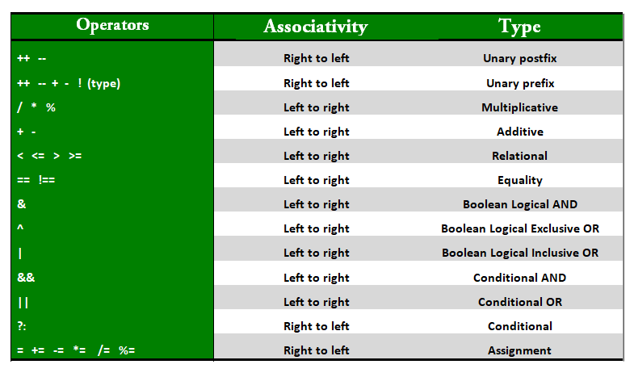

# Keywords
- strictfp
- assert
- sealed & permits
    - If we have sealed one class then the child class of it shuld available in the permits list and should be final or it should again be sealed class
- transient
    - If we want to do the same work without using the transient use the custom readObject and writeObject method
    - EX :- [Link](./Basics/src/TransientExample.java)

# Data types

# Operators
- unary operator
- binary operator
- ternary operator
- bitwise operator 
- shift operator
- instanceof operator

# Take input from user
- BufferedReader
- Scanner

# Proper way for commenting
- Reference blog - [Link](https://medium.com/@AlexanderObregon/how-to-comment-in-your-java-code-effectively-fe1b849da3a0)
- Example code - [Link](./Basics/src/sealed/Shape.java)

# Flow control
- if-else
- for
- while
- do-while 
- break
- continue
- return :- to exit from the method
- switch

    

