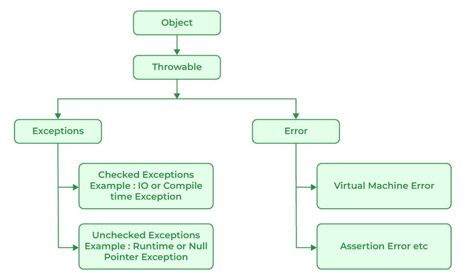
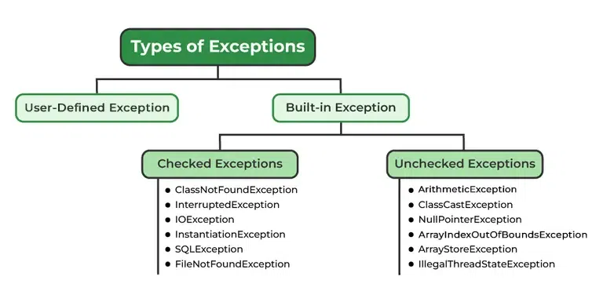
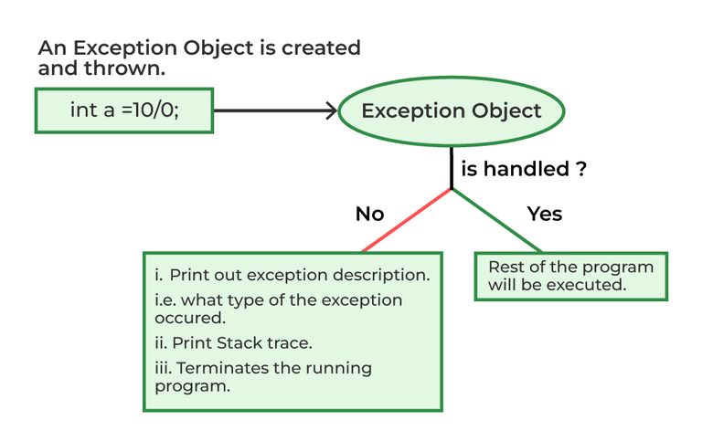
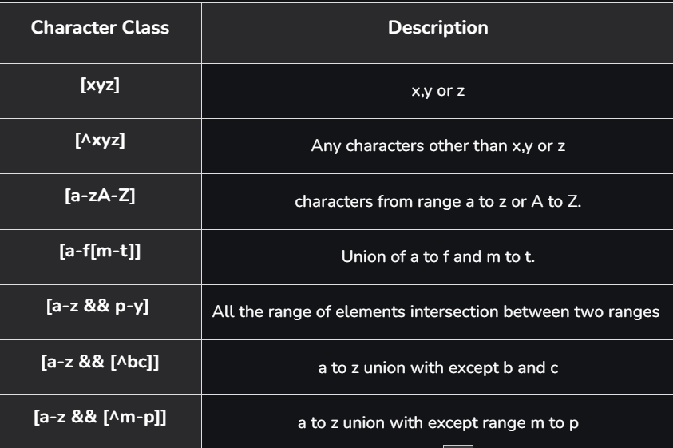
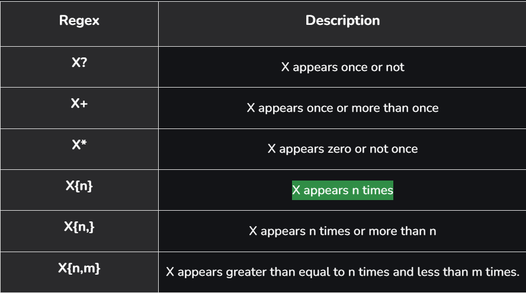
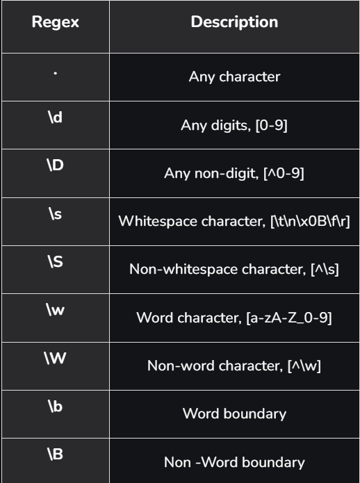

# Exception Handling
Exception is an unwanted or unexpected event.

### Major reasons why an exception Occurs
- Invalid user input
- Device failure
- Loss of network connection
- Physical limitations (out-of-disk memory)
- Code errors
- Out of bound
- Null reference
- Type mismatch
- Opening an unavailable file
- Database errors
- Arithmetic errors

### Difference between error and exception

**Error**: An Error indicates a serious problem that a reasonable application should not try to catch.

**Exception**: Exception indicates conditions that a reasonable application might try to catch

1) Checked exception
    - Checked exceptions are called compile-time exceptions because these exceptions are checked at compile-time by the compiler.
    - checked exceptions must be either caught by the caller or listed as part of the method signature using the throws keyword.

2) Unchecked exception
    - Occurs during the runtime.

### The advantages of Exception Handling in Java are as follows:

- Provision to Complete Program Execution
- Easy Identification of Program Code and - Error-Handling Code
- Propagation of Errors
- Meaningful Error Reporting
- Identifying Error Types

### Keywords
- try
- catch
- throw
- throws
- finally
    - if system.exit is executed then and only then it is not executed

### Exceptions:- 
- NullPointerException (A type of RuntimeException)
    - Invoking a method from a null object.
    - Accessing or modifying a null object’s field.
    - Taking the length of null, as if it were an array.
    - Accessing or modifying the slots of null objects, as if it were an array.
    - Throwing null, as if it were a Throwable value.
    - When you try to synchronize over a null object.
- IllegalArgumentException

# Regex

### difference between g+g and g++g
- g+g allows backtracking and g++g doesn't allow backtraking to succeed the pattern.

