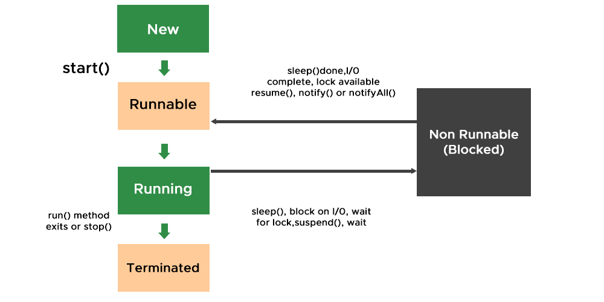
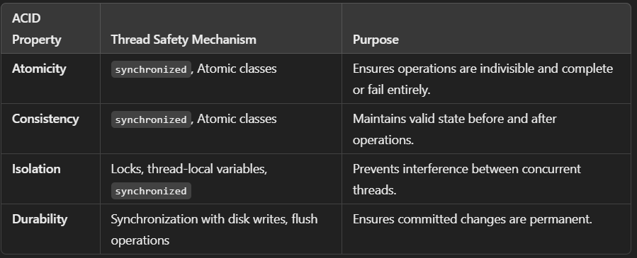

# Multithreading

### Multiprocessing 
- Process-based multitasking is a heavyweight process and occupies different address spaces in memory. Hence, while switching from one process to another, it will require some time be it very small, causing a lag because of switching. This happens as registers will be loaded in memory maps and the list will be updated.
### Multithreading 
- Thread-based multitasking is a lightweight process and occupies the same address space. Hence, while switching cost of communication will be very less.

### Why Threads are used? 
- Now, we can understand why threads are being used as they had the advantage of being lightweight and can provide communication between multiple threads at a Low Cost contributing to effective multi-tasking within a shared memory environment. 

### Important termas
- Thread class
- priority of the thread
- difference between run and start method of thread class
- we can't call the start() twise it sends the IllegalStateException.
- run() will not able to handle the checkd exception so we have to hande it by try catch.

### sleep() method
- IllegalArgumentException :- unchecked (ex. sleep(-100))
- InterruptedException :- checked

### Deamon Thread
- Low priority thread
- setDeamon(boolean) method
    - IllegalThreadStateException: if only this thread is active.
    - SecurityException: if the current thread cannot modify this thread.

### Thread Safty
- volatile (Mark the field)
- atomic (AtomicInteger)
    - AtomicInteger
    - AtomicLong
    - AtomicBoolean
    - AtomicReference
- synchronized (It is a block)
- final keyword
    
- **synchronized:** Uses locks to ensure mutual exclusion, which can lead to blocking and potential context switching.
- **AtomicInteger**: Uses Compare-And-Swap (CAS), which is a non-blocking mechanism, avoiding the overhead of locking.
- **volatile** is useful for ensuring visibility in simple read/write operations.

---
### Executor Thread Pool Methods

#### newFixedThreadPool(int)          
- Creates a fixed size thread pool.
#### newCachedThreadPool()
- Creates a thread pool that creates new threads as needed, but will reuse previously constructed threads when they are available
#### newSingleThreadExecutor()
- Creates a single thread. 
#### Risk in ThreadPool
- Deadlock
    - Waiting for the thread which is in the queue
- Thread Leakage
    - Can not returns the thread after the execution
- Resource Threashing
    - If the thread pool size is very large then time is wasted in context switching between threads. 
- The Thread Pool has to be ended explicitly at the end

#### Tuning Thread Pool

The optimum size of the thread pool depends on the number of processors available and the nature of the tasks. On a N processor system for a queue of only computation type processes, a maximum thread pool size of N or N+1 will achieve the maximum efficiency.But tasks may wait for I/O and in such a case we take into account the ratio of waiting time(W) and service time(S) for a request; resulting in a maximum pool size of N*(1+ W/S) for maximum efficiency.

### ThreadGroup
- lower level utility to manage the thread